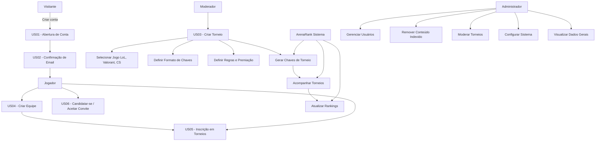

🎮 ArenaRank — Product Requirements Document (PRD)
1. 🎯 Visão Geral e Objetivo

A ArenaRank é uma plataforma web voltada para jogadores amadores e semi-profissionais, permitindo:

Criação e gerenciamento de torneios
Formação e gerenciamento de equipes
Participação em campeonatos
Visualização de rankings de jogadores e equipes

🎯 Objetivo principal:
Centralizar a organização de competições de eSports de forma acessível, estruturada e escalável.

🎮 Jogos foco (MVP):

League of Legends
Valorant
Counter-Strike
2. 👥 Atores do Sistema
🧑 Visitante
Acessa a plataforma sem autenticação
Visualiza torneios, rankings e interface geral
🎮 Jogador (Autenticado)
Cria e gerencia equipes
Participa de equipes
Se inscreve em torneios (se for líder)
🛠️ Moderador (Role adicional)
Cria e gerencia torneios
Define regras e formatos
Controla inscrições
🛡️ Administrador
Gerencia usuários
Remove conteúdo inadequado
Modera torneios
Configura o sistema
Acessa dados e métricas
⚙️ Sistema (ArenaRank)
Geração automática de chaves (brackets)
Atualização de rankings
Controle de inscrições e estados de torneios
3. 📋 Histórias de Usuário (MVP)
👤 Épico 1: Autenticação e Conta

US01 — Criação de Conta

Como visitante, quero criar uma conta com usuário, e-mail e senha para acessar a plataforma.

Critérios de Aceite:

Campos obrigatórios validados
Senha com requisitos mínimos
E-mail único

US02 — Confirmação de E-mail

Como usuário, quero confirmar meu e-mail para ativar minha conta.

Critérios de Aceite:

Envio automático de e-mail
Link de confirmação válido por tempo limitado
Conta só ativa após confirmação
🕹️ Épico 2: Uso da Plataforma

US03 — Criação de Torneios

Como moderador, quero criar torneios definindo jogo, formato e regras.

Critérios de Aceite:

Seleção de jogo (LoL, Valorant, CS)
Tipos de chave (ex: eliminatória simples, dupla)
Campo de descrição (regras/premiação)
Definição de número de equipes

US04 — Criação de Equipes

Como jogador, quero criar uma equipe para competir.

Critérios de Aceite:

Nome da equipe
Limite de até 10 jogadores
Definição de líder

US05 — Inscrição em Torneios

Como líder de equipe, quero inscrever minha equipe em torneios.

Critérios de Aceite:

Seleção de equipe
Seleção de jogadores participantes
Validação de requisitos do torneio

US06 — Participação em Equipes

Como jogador, quero entrar em equipes.

Critérios de Aceite:

Solicitação de entrada
Aceite/rejeição pelo líder
Sistema de convites
4. ⚠️ Lacunas Importantes (Recomendado adicionar)

Aqui estão pontos críticos que faltam no seu PRD e são essenciais para um MVP funcional:

🧩 Torneios (Operação)
Status do torneio:
Aberto
Em andamento
Finalizado
Atualização de partidas:
Quem reporta resultado?
Validação de resultados?

👉 Sugestão de US:
US07 — Reportar Resultado de Partida

🏆 Rankings
Critério de pontuação
Atualização automática após torneios

👉 Sugestão:
US08 — Visualizar Ranking

Como usuário, quero ver rankings de jogadores/equipes.

🔔 Notificações (Muito importante)
Convite para equipe
Aprovação
Início de torneio

👉 Sugestão:
US09 — Receber Notificações

🔐 Segurança
Recuperação de senha
Proteção contra spam
5. 🧱 Requisitos Funcionais
Autenticação (login/registro)
CRUD de equipes
CRUD de torneios
Sistema de inscrições
Geração de brackets
Sistema de ranking
6. ⚙️ Requisitos Não Funcionais
Responsividade (mobile + desktop)
Escalabilidade (torneios simultâneos)
Segurança (criptografia de senha)
Performance (carregamento rápido de brackets)
7. 📊 Métricas de Sucesso
Número de usuários registrados
Número de torneios criados
Taxa de participação em torneios
Retenção de usuários
8. 🚀 Sugestões Estratégicas (Produto)

Aqui vai um insight importante:

👉 Seu produto tem muito potencial, mas o diferencial precisa ser claro.

Sugestões:

Sistema de ranking estilo “elo”
Perfis de jogadores (estatísticas)
Integração futura com APIs de jogos
Sistema de premiação (mesmo que simbólico)
9. 📌 Próximo Passo

Se quiser evoluir isso ainda mais, posso te ajudar com:

🧱 Arquitetura (backend + frontend)
🗄️ Modelagem de banco de dados
🎨 UX/UI (fluxos de tela)
🧪 Roadmap técnico (MVP → V1)
