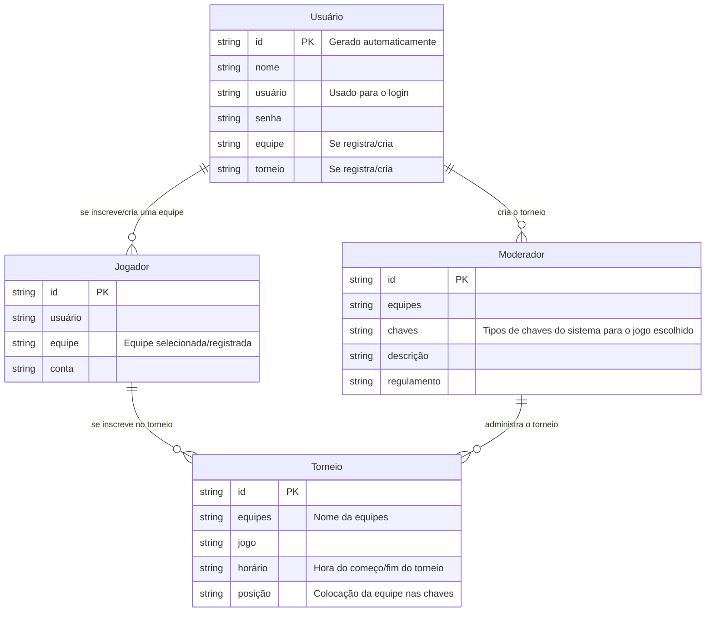

# 🛠️ Especificação Técnica (Tech Spec) - ArenaRank

Este documento detalha arquitetura técnica, o modelo de dados e os contratos de API (via JSON Server) necessárias para o funcionamento da plataforma de torneios e-sports amadores ArenaRank.

## 1. Modelo de Dados (Diagrama ER)

Abaixo está o Diagrama Entidade-Relacionamento (DER) que representa a estrutura do nosso "banco de dados" (`db.json`) e como as informações se conectam.

## 2. Dicionário de Dados

Breve explicação das tabelas principais:

- **Usuário:** Responsável pelo registro de equipes, pela criação ou participação de torneios podendo
